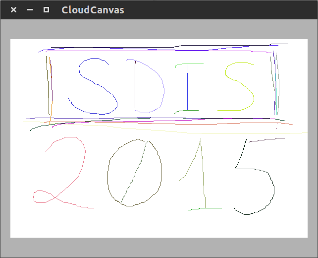

# SDIS - CloudCanvas

## Segundo projeto - Relatório

## Índice

1. Introdução
2. Arquitetura
  1. Servidor HTTP
  2. TCP P2P
  3. Comunicação entre *peers*
3. Implementação
4. Informações relevantes
5. Conclusão
  1. Melhoramentos

## Introdução

A aplicação desenvolvida procura oferecer aos seus utilizadores uma aplicação de desenho colaborativo para multi-plataformas (PC/MAC e Android).  
Fez-se uso de prótocolos TCP *peer-to-peer* e contém um servidor REST que trata de ligar os utilizadores a um peer da sala a que se desejam juntar.

É possível para os utilizadores criarem salas de desenho e juntarem-se a outras.  
Quando alguém se junta a uma sala, é apresentado o ecrã dessa mesma sala, que consiste numa tela.  
Cada sala é única (o que é desenhado na tela de uma sala não é desenhado nas outras) e permite que os utilizadores desenhem da forma que quiserem ao mesmo tempo. 

Este relatório abrangirá a arquitetura da nossa aplicação, bem como as nossas decisões de implementação. Informações que achamos relevantes transmitir, e finalmente uma conclusão.

## Arquitetura

#### Servidor HTTP

O servidor recebe e responde correctamente aos seguintes HTTP requests:

- **ip/canvas/getRoomList** - Pedido GET que devolve a lista de salas existentes, assim como o IP de alguém que se encontra de momento na sala
- **ip/canvas/joinRoom** - Pedido POST com a query: "roomName=<nome>", que incrementa o número de utilizadores presentes na sala
- **ip/canvas/leaveRoom** - Pedido POST com a query "roomName=<nome>", que decrementa o número de utilizadores presente na sala, e no caso de ser 0 a elimina
- **ip/canvas/CreateRoom** - Pedido POST com a query "userIp=<ip>", que cria uma sala com o nome default "Sala" com população de 1 e com o IP do utilizador que a criou para que outros se possam juntar

O servidor responde adequadamente com os códigos de resposta HTTP: 

- **200** em caso de sucesso
- **400** em caso de erro de syntax ou de query
- **404** quando se acede a qualquer ficheiro em `ip/canvas/...` que não seja válido

O servidor corre numa **VPS** fornecida pela DigitalOcean. Por essa razão, o IP:porta utilizado nos HTTPRequest enviados pela aplicação é fixo (*hardcoded*), e corresponde ao dessa mesma VPS.

## TCP P2P

### TCP *Peer-to-peer*

A comunicação entre utilizadores na nossa aplicação de desenho é feita com uma rede *peer-to-peer*, com ligações TCP em que os *peers* se encontram todos ligados uns aos outros.

Cada **peer** contém um *server socket* por onde aceita conexões novas, e ainda um *socket* por cada **peer** a que se encontra conectado.

### Comunicação entre *peers*

A comunicação entre *peers* é feita pelo envio de objectos que contêm um de 6 tipos: **JOIN**, **GET_PEERS**, **PEERS**, **PULL_DRAWING**, **DRAWING**, **CURVE**.

##### JOIN

A mensagem JOIN é enviada quando um *peer* se junta à sala, de forma a avisar todos os outros *peers* que ele se acabou de juntar.

##### GET_PEERS

Quando um *peer* se junta a uma sala, só tem conhecimento de um outro *peer*: aquele cujo IP está associado à sala no servidor, ao qual se envia a mensagem JOIN.

A mensagem GET_PEERS é enviada quando um *peer*, após se juntar a uma sala, pede a lista de quem se encontra na sala actualmente, porque ainda só tem conhecimento de um outro *peer* na sala.

##### PEERS

Esta é a mensagem de resposta a uma mensagem GET_PEERS. Consiste num array que contém todos os IPs dos *peers* da lista do *peer* que a envia.

##### PULL_DRAWING

Esta mensagem serve para pedir o desenho atual da sala, na sua totalidade.

Um *peer* que se junte à sala e tenha acabado de receber os *peers* presentes nessa mesma sala, envia esta mensagem a um desses *peers*. A escolha desse peer é feita aleatoriamente. Esta escolha é aleatória, porque se cada *peer* que se juntasse à sala pedisse o desenho ao mesmo *peer* (ao que tem o IP associado à sala no servidor, por exemplo), a rede ficaria sobrecarregada na eventualidade de se juntarem muitos *peers* aproximadamente ao mesmo tempo.

##### DRAWING

Esta é a mensagem de resposta à mensagem **PULL_DRAWING**, e contém o desenho atual da sala.

##### CURVE

Mensagem enviada sempre que um *peer* desenha uma curva nova, para todos os seus *peers*. Esta é a forma de manter a sala toda com o mesmo desenho ao longo do tempo.

---

**Nota -** Caso não consiga visualizar a animação acima, visite o link: http://i.imgur.com/Cbe243P.gif

O protocolo da conexão entre *peers* corresponde ao envio de uma mensagem **JOIN** para o único *peer* conhecido ao entrar na sala.  
Imediatamente depois, é enviado um **GET_PEERS** para o mesmo *peer* utilizado ao enviar a mensagem **JOIN**.  
Depois do *peer* atualizar a sua lista de *peers*, envia uma mensagem **JOIN** a cada um, seguido finalmente de um **PULL_DRAWING** a partir do qual começa a enviar mensagens **CURVE** sempre que desenha na sala.

Os sockets que establecem a ligação entre *peers* são criados quando o *server socket* de um *peer* recebe uma conexão nova com uma mensagem **JOIN**, e a partir daí a comunicação entre esses dois *peers* é feita exclusivamente por essa conexão.  
Os *peers* recebem notificações quando os outros *peers* se retiram pela quebra no socket que os liga.

## Implementação

O servidor HTTP foi implementado com apoio à classes de Java do Sun: **HTTPServer** e **HTTPHandler**. Este responde aos vários pedidos feitos através de várias instâncias da thread **Handler**.

A implementação TCP *peer-to-peer* é feita tendo um **ServerSocket** que aceita as novas conexões, e um **Socket** que se guarda depois do *accept()* do **ServerSocket**.

## Informações relevantes

A nossa aplicação é **escalável** e **consistente**.

A primeira característica é consequência da boa arquitetura implementada ao longo do desenvolvimento do aplicação.  
A segunda característica é possível com recurso à ordenação das curvas no desenho, com base no *timestamp* associado a cada curva.  
Como cada dispositivo que corre a aplicação pode ter um relógio atrasado ou adiantado, o *timestamp* de cada curva é obtido com um pedido HTTP ao servidor, que responde com o seu próprio *timestamp*. Desta forma, mesmo que o relógio do servidor esteja incorrecto não há problema, pois todas as curvas estão unificadas com o tempo marcado por esse relógio.

## Conclusão

Compreendemos melhor a necessidade do estudo e cuidado na escolha da implementação da arquitectura e dos protocolos, e achamos que conseguimos um bom trabalho neste aspecto, pois conseguimos uma aplicação rápida e eficaz.

Os membros do grupo trabalharam em conjunto, tanto no planeamento como na implementação, e dividimos o nosso esforço igualmente em 25% por cada um.

### Melhoramentos

De seguida encontram-se alguns melhoramentos que poderiam ter sido implementados com mais algum tempo.

- Alargar a aplicação para uma que não se restrinja a uma lan, utilizando *hole-poking* para realizar ligações TCP *peer-to-peer*;
- Deixar o utilizador escolher as salas, bem como criar as salas que quiser, pois o servidor já está preparado e  permite isso.
